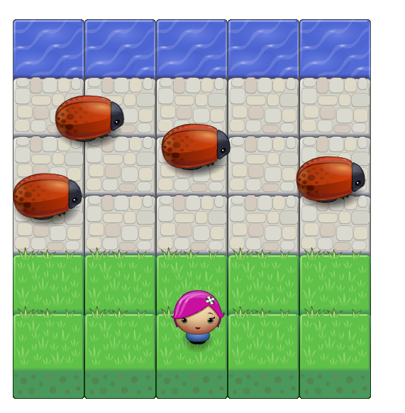

frontend-nanodegree-arcade-game
===============================

This is my Frogger arcade game for the Udacity "Front-End Web Development nanodegree".

Game Description:
-----------------

In this project we have a Player and Enemies. The goal is the player must reach to up then goes down without colliding with the enemies. If the player collided with enemies, the player will lose. if the player reach up without colliding with the enemies, will win. 

Moving:
----------

- The player can be moved with the arrow keys, can move up, down, left and right. 

- The enemies move in different speeds.

Demo:
-------

To play the game:
---------------
To play the game you must run the index.html file in a browser.
> [Check it in github](https://github.com/norahqahtani11/arcade-game-master).
